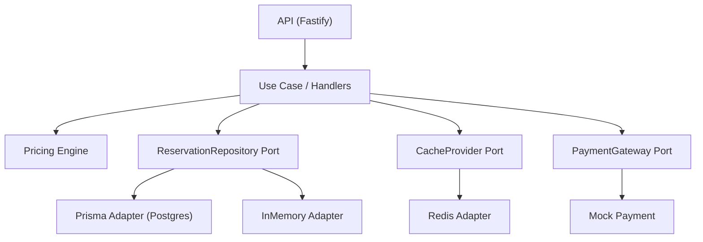

# RFC-001: StellarStay Hotels Architecture

## Executive Summary
- Build a scalable, reliable reservation system with clear hexagonal boundaries.
- Implement Option B endpoints to validate pricing, persistence, idempotency, and reliability.
- Targets: 50k+ bookings/day, 99.9% uptime during peaks.

## Service Architecture (Hexagonal)
- Reservation Service: coordinates booking lifecycle and idempotency.
- Pricing Service: deterministic price calculation with ordered rules.
- Room Service: inventory (seeded), overlap checking per roomType.
- Payment Service: mocked adapter; real provider port defined.

Primary Port: REST controllers. Secondary Ports: ReservationRepository, RoomAvailabilityProvider, PaymentGateway, CacheProvider.



## Communication
- REST endpoints (Option B): `POST /api/reservations`, `GET /api/reservations/{id}`.
- Errors: `{ code, message, details? }` with 400/404/409/5xx.
- Idempotency: `idempotency-key` header ensures safe retries.

## Data Architecture
- Postgres (production path), In-Memory (dev/tests) via repository port.
- Tables: `Room`, `Reservation` (fields include pricingBreakdown JSON, idempotencyKey unique).
- Consistency: strong for reservations; store pricing breakdown for audit.

## Reliability & Observability
- **Retry/backoff**: outbound ports use exponential backoff with jitter (retries=3, base=200ms).
- **Timeouts**: Request 8s, DB 3s, Redis 500ms, External APIs 5s.
- **Circuit breakers**: Prisma (3 failures, 30s reset), Redis (5 failures, 15s reset).
- **Availability check**: overlap detection per roomType returning 409 with DB-level exclusion constraints.
- **Idempotency on POST**: duplicate keys return prior result with race condition handling.
- **Health**: `/health`; add readiness checks for DB/Redis when enabled.
- **Logging**: structured with correlation IDs (`X-Correlation-Id`).
- **Metrics (future)**: add Prometheus counters/histograms for request count/latency and errors.

### Retry Implementation Example
```javascript
// Applied to all Prisma queries
const result = await withRetry(
  () => prisma.reservation.create({ data: { ... } }),
  { retries: 3, baseDelayMs: 200, jitterMs: 100 }
);
```

### Circuit Breaker Implementation Example
```javascript
// Wraps all external service calls
const result = await prismaBreaker.execute(async () => {
  return await withRetry(
    () => prisma.reservation.create({ data: { ... } }),
    { retries: 3, baseDelayMs: 200, jitterMs: 100 }
  );
});
```

## Scalability
- Stateless API; horizontal scaling behind a load balancer.
- Caching with Redis for hot GETs; TTL-based invalidation on create.
- DB considerations: read replicas, connection pooling as traffic grows.

## Pricing Rules (Order)
1. Base rate per room type per day.
2. Length discount adjusts per-day rate (4–6: -$4, 7–9: -$8, 10+: -$12).
3. Weekend multiplier +25% applied per day.
4. Breakfast surcharge +$5 per guest per day.

## Technology Choices
- Node.js + Fastify, zod, Prisma (Postgres), Redis, Vitest + supertest.
- Rationale: speed, clarity, testability, and straightforward hexagonal wiring.

## Security
- Input validation (zod); no secrets in repo; env-based config.

## Error Taxonomy
- 400 BAD_REQUEST (validation, invalid date ranges)
- 404 NOT_FOUND (reservation id missing)
- 409 CONFLICT (overlap detected)
- 5xx internal/unexpected errors

## AI Integration (Bonus)
- **POST /api/ai/query**: Natural language room search using Ollama
- **Intent parsing**: Extracts room type, dates, price range, guest count
- **Room recommendations**: Filtered suggestions based on parsed intent
- **Circuit breaker protection**: External API calls wrapped with failure handling
- **Fallback behavior**: Graceful degradation when AI service unavailable

## Future Work
- Payment gateway integration with retries + circuit breaker.
- Outbox + Kafka for reservation-created events.
- Prometheus + Grafana dashboards and alerts.
- OpenAPI/Swagger documentation.
